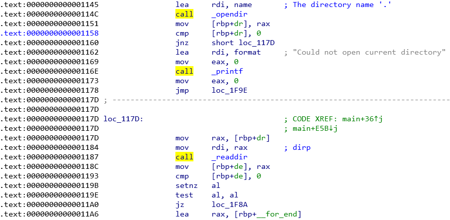
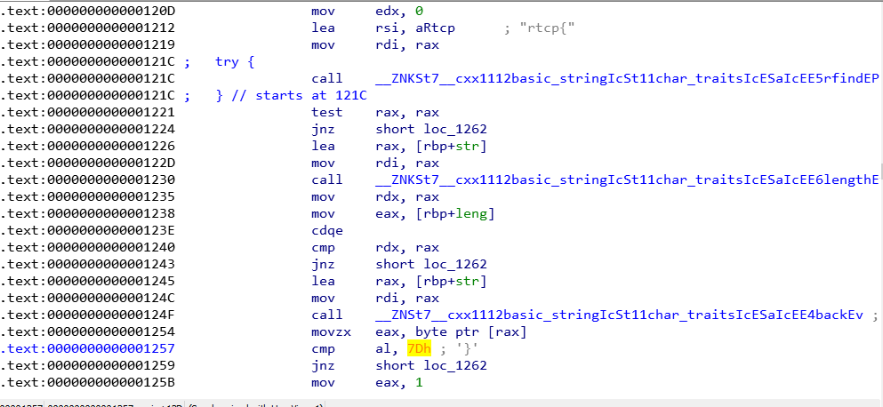
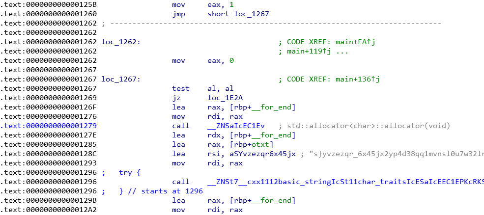
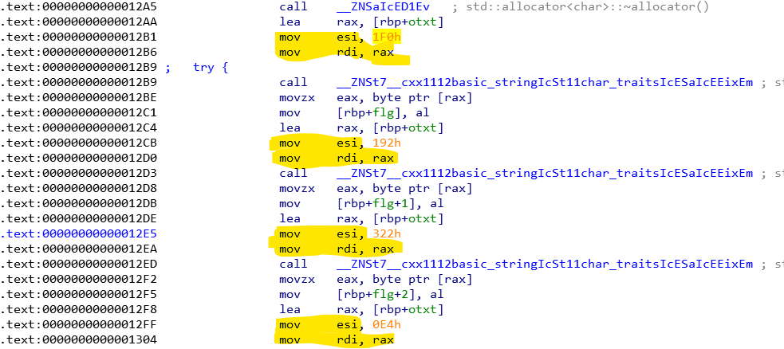
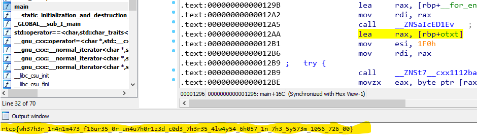

# ghost-in-the-system

## Description

I think my `ls` is being haunted... the colors are all weird!!! What's that? It's highlighting things?! Where!!?

### Hint 1

Flag is `100` characters long.
It starts with `rtcp{` and ends with `}`
The first character is `w`

### Hint 2

The flag is written in standard leet, the only exceptions are the flag wrapping (`rtcp{}`) and underscores (`_`)

### Solution

Observe the `call`'s in the figure 1:

 Figure 1 - Scope of function main

The program opens a directory and read it, the directory always will be '.'

In Figure 2 is possible to see a verification for `rtcp{` and `}`, I ignored this and keep read.

 Figure 2 - verifications

More below we have the Figure 3 and here we found a big variable `aSYvzezqr6x45jx` (double click and you will see)

 Figure 3 - a big buffer reference

Following and we get the Figure 4 with some nice pattern that occurs 100 times, exactly the flag size! This pattern brings the offset that are need to get the chars from the variable `aSYvzezqr6x45jx` and build the flag.

 Figure 4 - a pattern

Time to code and practive the `Ida Fu`

```
$ cat ida_script.py
import idautils

sc = idautils.Strings()
# the buffer is at offset 0x00000000000021E8 offset
buffer = str([s for s in sc if hex(s.ea) == '0x21e8L'][0])
flag = ''
get_next = False


for function_ea in idautils.Functions():
    for ins in idautils.FuncItems(function_ea):
        if idaapi.isCode(idaapi.getFlags(ins)):
            cmd = idc.GetDisasm(ins)
            if get_next and idc.GetMnem(ins) == 'mov':
                value = idc.GetOpnd(ins, 1)
                if value.endswith('h'):
                    value = "0x" + value.replace('h', '')
                    value = int(value, 16)
                    flag += buffer[value]
                get_next = False
            if cmd == 'lea     rax, [rbp+otxt]':
                get_next = True

print(flag)
```

Execute the script above and get the flag in IDA Output Window (figure 5).

 Figure 5